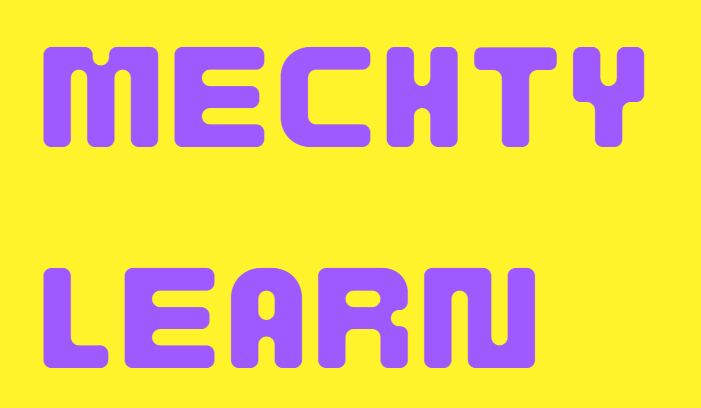

<a name="readme-top"></a>

[![Progress][progress-shield]][progress-url]
[![Issues][issues-shield]][issues-url]
[![LinkedIn][linkedin-shield]][linkedin-url]


<!-- PROJECT LOGO -->
<br />
<div align="center">
  <a href="https://github.com/galveron/Musicly-project">
    
  </a>

  <h3 align="center">Musicly app</h3>

</div>

<!-- TABLE OF CONTENTS -->
<details>
  <summary>Table of Contents</summary>
  <ol>
    <li>
      <a href="#about-the-project">About The Project</a>
      <ul>
        <li><a href="#built-with">Built With</a></li>
      </ul>
    </li>
    <li>
      <a href="#getting-started">Getting Started</a>
      <ul>
        <li><a href="#prerequisites">Prerequisites</a></li>
        <li><a href="#installation">Installation</a></li>
      </ul>
    </li>
    <li><a href="#contact">Contact</a></li>
    <li><a href="#acknowledgments">Acknowledgments</a></li>
  </ol>
</details>


<!-- ABOUT THE PROJECT -->
## About The Project

[![Product Name Screen Shot][product-screenshot]]("images/mecthy-learn.png")

Mechty Learn is an engaging web application designed to introduce children to the exciting world of mechanics and vehicles. Built with ASP.NET Core, Identity Framework, AWS, and React, MechtyKids offers a modern and interactive learning experience for kids aged 6-12.

Key Features:

* Interactive Lessons: Engaging lessons and tutorials teach kids the basics of mechanics, vehicles, and engineering concepts in a fun and easy-to-understand way.
* User Authentication: Secure user authentication and management powered by ASP.NET Core Identity Framework ensure a safe and personalized learning environment for each child.
* Scalable Infrastructure: Leveraging AWS for hosting and storage, MechtyKids provides a reliable and scalable platform to accommodate growing user demands.
* Responsive Design: Built with React, MechtyKids is accessible on various devices, including desktops, tablets, and smartphones, ensuring seamless learning experiences anytime, anywhere.

<p align="right">(<a href="#readme-top">back to top</a>)</p>

### Built With

* [![Express][Express.js]][Express-url]
* [![React][React.js]][React-url]
* [![Mongoose][Mongoose.com]][Mongoose-url]
* [![Bootstrap][Bootstrap.com]][Bootstrap-url]

<p align="right">(<a href="#readme-top">back to top</a>)</p>


<!-- GETTING STARTED -->
## Getting Started

To try out our application, please follow the next steps:

### Prerequisites

* npm
  ```sh
  npm install
  ```

### Installation

1. Clone the repo
   ```sh
   git clone https://github.com/galveron/mechty-learn
   ```
   
<p align="right">(<a href="#readme-top">back to top</a>)</p>


<!-- CONTACT -->
## Contact

My profile on LinkedIn: [@veron-gal](www.linkedin.com/in/veron-gal)

Project Link: [https://github.com/galveron/mechty-learn](https://github.com/galveron/mechty-learn)

<p align="right">(<a href="#readme-top">back to top</a>)</p>


<!-- MARKDOWN LINKS & IMAGES -->
[progress-shield]: https://img.shields.io/badge/Progress-8B0000?style=for-the-badge&logo=data:image/svg%2bxml;base64,aHR0cHM6Ly9zdGF0aWMudGhlbm91bnByb2plY3QuY29tL3BuZy8zMDM5Mjk2LTIwMC5wbmc=
[progress-url]: https://github.com/galveron/Musicly-project/graphs/contributors
[issues-shield]: https://img.shields.io/github/issues/galveron/Musicly-project.svg?style=for-the-badge&colorB=FFC300
[issues-url]: https://github.com/galveron/Musicly-project/issues
[linkedin-shield]: https://img.shields.io/badge/-LinkedIn-black.svg?style=for-the-badge&logo=linkedin&colorB=0096FF
[linkedin-url]: https://linkedin.com/in/veron-gal
[product-screenshot]: images/musicly-screenshot.png
[Express.js]: https://img.shields.io/badge/express.js-000000?style=for-the-badge&logo=expressjs&logoColor=white
[Express-url]: https://expressjs.com/
[React.js]: https://img.shields.io/badge/React-20232A?style=for-the-badge&logo=react&logoColor=61DAFB
[React-url]: https://reactjs.org/
[Mongoose.com]: https://img.shields.io/badge/mongoose-8B0000?style=for-the-badge&logo=mongoose&logoColor=white
[Mongoose-url]: https://mongoosejs.com/
[Bootstrap.com]: https://img.shields.io/badge/Bootstrap-563D7C?style=for-the-badge&logo=bootstrap&logoColor=white
[Bootstrap-url]: https://getbootstrap.com
