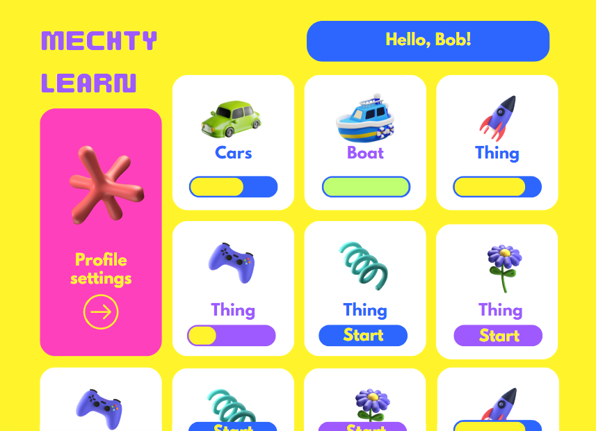

<a name="readme-top"></a>

[![Progress][progress-shield]][progress-url]
[![Issues][issues-shield]][issues-url]
[![LinkedIn][linkedin-shield]][linkedin-url]


<!-- PROJECT LOGO -->
<br />
<div align="center">
  <h2 align="center">Mechty Learn App</h2>
  <a href="https://github.com/galveron/mechty-learn">
    
  </a>
</div>

<!-- TABLE OF CONTENTS -->
<details>
  <summary>Table of Contents</summary>
  <ol>
    <li>
      <a href="#about-the-project">About The Project</a>
      <ul>
        <li><a href="#built-with">Built With</a></li>
        <li><a href="#progress">Progress</a></li>
      </ul>
    </li>
    <li>
      <a href="#getting-started">Getting Started</a>
      <ul>
        <li><a href="#prerequisites">Prerequisites</a></li>
        <li><a href="#installation">Installation</a></li>
      </ul>
    </li>
    <li><a href="#contact">Contact</a></li>
  </ol>
</details>


<!-- ABOUT THE PROJECT -->
## About The Project

Mechty Learn is an engaging web application designed to introduce children to the exciting world of mechanics and vehicles. Built with ASP.NET Core, Identity Framework, AWS, and React, Mechty Learn offers a modern and interactive learning experience for kids aged 6-12.

Key Features:

* Interactive Lessons: Engaging lessons and tutorials teach kids the basics of mechanics, vehicles, and engineering concepts in a fun and easy-to-understand way.
* User Authentication: Secure user authentication and management powered by ASP.NET Core Identity Framework ensure a safe and personalized learning environment for each child.
* Multiplayer: Step-by-step projects and activities allow kids to apply what they've learned, fostering creativity and problem-solving skills especially when they can compare their knowledge with others
* Scalable Infrastructure: Leveraging AWS for hosting and storage, Mechty Learn provides a reliable and scalable platform to accommodate growing user demands.
* Responsive Design: Built with React, Mechty Learn is accessible on various devices, including desktops, tablets, and smartphones, ensuring seamless learning experiences anytime, anywhere.

<p align="right">(<a href="#readme-top">back to top</a>)</p>

### Built With

* [![Asp.netCore][Asp.netCore]][Asp.netCore-url]
* [![Aws][Aws]][Aws-url]
* [![Azure][Azure]][Azure-url]
* [![React][React.js]][React-url]
* [![Three][Three.js]][Three.js-url]
* [![TypeScript][TypeScript]][TypeScript-url]
* [![Socket.io][Socket.io]][Socket.io-url]

<p align="right">(<a href="#readme-top">back to top</a>)</p>

<a name="progress"></a>
### Progress

This project is in progress. Here are the steps what I already done:

* Planning, decide technics, discuss plans with mentor
* Set up backend
* Create database with Entity Framework Core
* Create main controller and repository methods

If you are interested in what I am currently working on, you can check the open issues: 
[https://github.com/galveron/mechty-learn/issues](https://github.com/galveron/mechty-learn/issues)

<!-- GETTING STARTED -->
## Getting Started

To try out our application, please follow the next steps:

### Prerequisites

* npm
  ```sh
  npm install
  ```

### Installation

1. Clone the repo
   ```sh
   git clone https://github.com/galveron/mechty-learn
   ```
   
<p align="right">(<a href="#readme-top">back to top</a>)</p>


<!-- CONTACT -->
## Contact

My profile on LinkedIn: [@veron-gal](www.linkedin.com/in/veron-gal)

Project Link: [https://github.com/galveron/mechty-learn](https://github.com/galveron/mechty-learn)

<p align="right">(<a href="#readme-top">back to top</a>)</p>


<!-- MARKDOWN LINKS & IMAGES -->
[progress-shield]: https://img.shields.io/badge/In-Progress-8B0000.svg?style=for-the-badge
[progress-url]: https://github.com/galveron/mechty-learn/blob/main/README.md#progress
[issues-shield]: https://img.shields.io/github/issues/galveron/mechty-learn.svg?style=for-the-badge
[issues-url]: https://github.com/galveron/mechty-learn/issues
[linkedin-shield]: https://img.shields.io/badge/-LinkedIn-black.svg?style=for-the-badge&logo=linkedin&colorB=0096FF
[linkedin-url]: https://linkedin.com/in/veron-gal
[product-screenshot]: images/mecthy-screenshot.png
[Asp.netCore]: https://img.shields.io/badge/ASP.NET_Core-512BD4?style=for-the-badge&logo=.net&logoColor=white
[Asp.netCore-url]: https://dotnet.microsoft.com/en-us/apps/aspnet
[Aws]:https://img.shields.io/badge/aws-232F3E?style=for-the-badge&logo=amazonaws&logoColor=white
[Aws-url]:https://aws.amazon.com/?nc2=h_lg
[Azure]:https://img.shields.io/badge/Microsoft_Azure-0078D4?style=for-the-badge&logo=microsoftazure&logoColor=white
[Azure-url]: https://azure.microsoft.com/en-us/free/search/?ef_id=_k_Cj0KCQjw_qexBhCoARIsAFgBlesj4zlpsF7CRNapEj4KFOyaQQQK_h9AJYF9m3mRFpVk_VZLzcc9OXcaAu0YEALw_wcB_k_&OCID=AIDcmmip7xznjm_SEM__k_Cj0KCQjw_qexBhCoARIsAFgBlesj4zlpsF7CRNapEj4KFOyaQQQK_h9AJYF9m3mRFpVk_VZLzcc9OXcaAu0YEALw_wcB_k_&gad_source=1&gclid=Cj0KCQjw_qexBhCoARIsAFgBlesj4zlpsF7CRNapEj4KFOyaQQQK_h9AJYF9m3mRFpVk_VZLzcc9OXcaAu0YEALw_wcB
[React.js]: https://img.shields.io/badge/React-20232A?style=for-the-badge&logo=react&logoColor=61DAFB
[React-url]: https://reactjs.org/
[Three.js]: https://img.shields.io/badge/THREE.js-000000?style=for-the-badge&logo=threedotjs&logoColor=61DAFB
[Three.js-url]: https://threejs.org/
[TypeScript]: https://img.shields.io/badge/typescript-3178C6?style=for-the-badge&logo=typescript&logoColor=white
[TypeScript-url]: https://www.typescriptlang.org/
[Socket.io]: https://img.shields.io/badge/Socket.io-010101?style=for-the-badge&logo=socketdotio&logoColor=white
[Socket.io-url]: https://socket.io/
